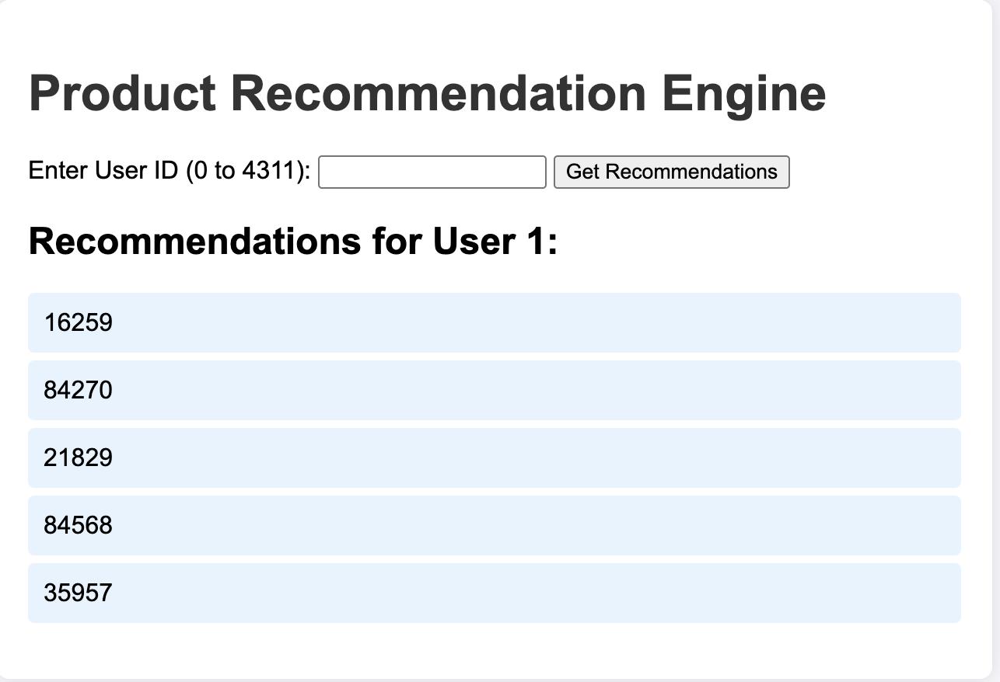

# recommendation-engine

AI-powered product recommendation system for marketplaces. Built with Python, TensorFlow, and Flask. Deployed on AWS.
## Results
- Achieved a training loss of ~17,000 after 10 epochs.
- Provides personalized product recommendations via a user-friendly web interface.
- **UI Screenshot**:
  